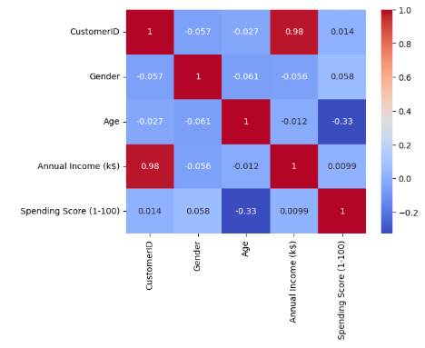
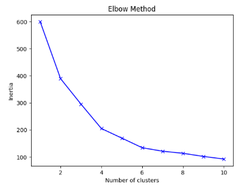
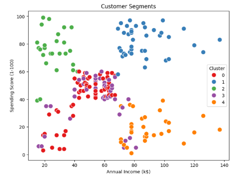

# 🛍️ Customer Segmentation Using Clustering

**Author:** Muhammad Sharique Baig

[](https://www.python.org/)  
[](https://scikit-learn.org/stable/)  
[](https://pandas.pydata.org/)  
[](https://matplotlib.org/)  
[](https://seaborn.pydata.org/)

---

## 🎯 Goal

The goal of this project was to **segment customers of a shopping mall** based on their **demographic** and **spending patterns**, using **unsupervised learning**.

👉 This helps businesses understand customer groups and **tailor marketing strategies**.

---

## 📂 Dataset

- **Source:** [Mall Customer Segmentation Data (Kaggle)](https://www.kaggle.com/datasets/vjchoudhary7/customer-segmentation-tutorial)
- **Features used:**
  - Age
  - Annual Income (k$)
  - Spending Score (1–100)
- **Note:** Gender was mapped to numeric values (`0 = Male`, `1 = Female`) but **not used** in clustering.

---

## 📊 Exploratory Data Analysis (EDA)

- **Age Distribution:** Most customers are between 20–50 years old.
- **Annual Income Distribution:** Income is fairly spread, with peaks around 40–70k.
- **Spending Score Distribution:** Customers are evenly distributed across low and high spending.
- **Correlation Heatmap:** Weak correlations among features → confirms clustering is useful.



---

## ⚖️ Feature Scaling

- Applied **StandardScaler** to normalize features:
  - Age
  - Annual Income
  - Spending Score

---

## 🤖 Clustering

- **Elbow Method:** Suggested **k = 5** as the optimal cluster number.
- **Model:** K-Means (`k=5`) applied on scaled features.
- **Silhouette Score:** ~0.55 → moderate but reasonable for real-world customer data.



---

## 🔎 Cluster Insights

Scatterplots revealed **five distinct customer groups**:

0. **Low Income – Low Spending:** Price-sensitive, occasional buyers.
1. **High Income – High Spending:** Premium customers; ideal for loyalty programs.
2. **Low Income – High Spending:** Enthusiastic but budget-limited shoppers.
3. **Mid Income – Moderate Spending:** Average customers; potential upsell opportunities.
4. **High Income – Low Spending:** Wealthy but disengaged shoppers.



---

## 💡 Business Insights

- **Clusters 1 & 2 (high spending):** Target with **exclusive offers & loyalty programs**.
- **Cluster 0 (budget-conscious):** Engage with **discounts** and seasonal promotions.
- **Cluster 4 (wealthy but disengaged):** Potential market — target with **personalized advertising**.
- **Cluster 3 (average group):** Consistent contributors; potential to **increase value via upselling**.

---

## ✅ Conclusion

Clustering successfully divided mall customers into **five distinct groups**.

These insights can help businesses:

- Personalize **marketing campaigns**
- Allocate **resources effectively**
- Improve **customer retention & engagement**

---

## 💻 How to Run

1. **Clone the repository**
   ```bash
   git clone https://github.com/ShariqueBaig/customer-segmentation.git
   cd customer-segmentation
   ```
2. **Install dependencies**
   ```bash
   pip install -r requirements.txt
   ```
3. **Run Jupyter Notebook**
